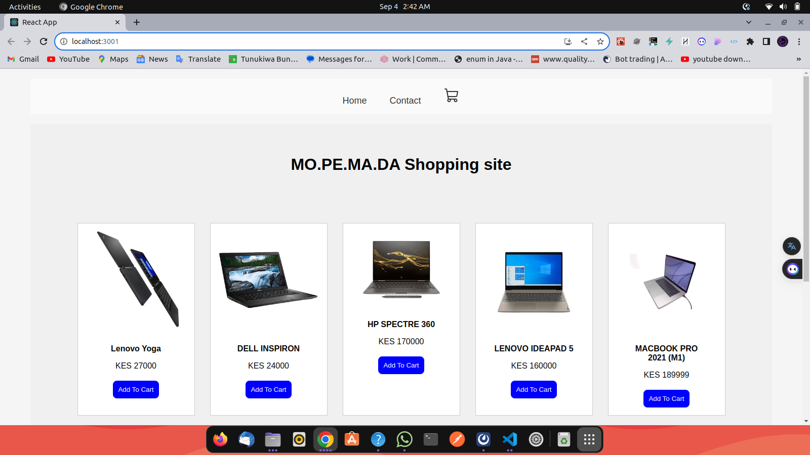

# Mopemada Shopping Site

[Project Demo](misc/screenshot demo.png)

## Table of Contents
- [Introduction](#introduction)
- [Authors](#authors)
- [Description](#description)
- [Technologies](#technologies)
- [Getting Started](#getting-started)
- [Live Site](#live-site)
- [License](#license)

## Introduction

Welcome to the Mopemada Shopping Site! This project was developed by a group of four talented individuals: Peter Ndirangu Nyambura, Martin Nyambeki, Mohammed Yusuf, and Danwyclif Ndwiga. The project is a React-based e-commerce website that offers a range of products for online shopping.

## Authors

- Peter Ndirangu Nyambura
- Martin Nyambeki
- Mohammed Yusuf
- Danwyclif Ndwiga

## Description

Mopemada Shopping Site is an online platform where users can explore and purchase a variety of products. The site features an intuitive user interface, allowing users to browse products, add them to the cart, and proceed to checkout. The project demonstrates the team's skills in React, JavaScript, and CSS to create an engaging and functional shopping experience.

## Technologies

- React
- JavaScript
- CSS

## Getting Started

To run the project locally on your machine, follow these steps:

1. Clone the repository: `git clone https://github.com/peternyambura/ecommerce-app.git`
2. Navigate to the project directory: `cd ecommerce-app.git`
3. Install dependencies: `npm install`
4. Start the development server: `npm start`

## Live Site

Check out the live site on GitHub Pages: [Mopemada Shopping Site](https://mopemada.netlify.app/)

## License

This project is licensed under the [MIT License](LICENSE).

---
